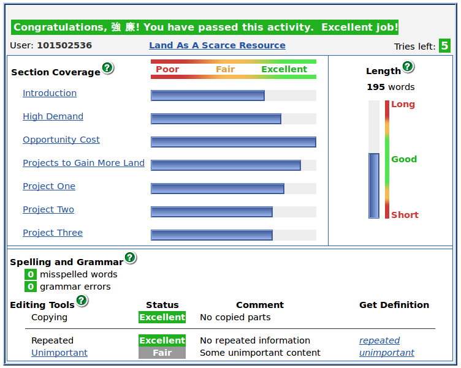

## 上學期

##### 八次最佳成績:

1. *Factors Affecting the Intensity of Food Consumption and Production* / Grade 10
2. *Impact of World War I* / Grade 10
3. *Land As A Scarce Resource* / Grade 10
4. *A River System* / Grade 9
5. *Action: Defence* / Grade 9
6. *Food Production -- Technological Factors* / Grade 9
7. *How People Can Change the Environment* / Grade 9
8. *The Importance of Studying Geography* / Grade 9

重要提醒:繳交作業前請再次檢查每篇文章級別都至少是 Grade 5 並達到 Fair 以上(若是 Essay 至少要達到 Grade 9  4分 以上)

##### 截圖: (提交作業前請再次確認每一張截圖都清晰可辨識)

1. *Factors Affecting the Intensity of Food Consumption and Production* / Grade 10

2. *Impact of World War I* / Grade 10

3. *Land As A Scarce Resource* / Grade 10

4. *A River System* / Grade 9

5. *Action: Defence* / Grade 9

6. *Food Production -- Technological Factors* / Grade 9

7. *How People Can Change the Environment* / Grade 9

8. *The Importance of Studying Geography* / Grade 9

## 下學期

##### 八次最佳成績:

1. *High Population Growth* / Grade 10
2. *Korean War* / Grade 10
3. *Picturing the Body* / Grade 10
4. *Consequences of Deforestation* / Grade 9
5. *Effects of Media Coverage* / Grade 9
6. *Genetically Modified Food* / Grade 9
7. *Landforms and Rocks -- Volcanoes* / Grade 9
8. *The Sky Is Falling* / Grade 9

重要提醒:繳交作業前請再次檢查每篇文章級別都至少是 Grade 5 並達到 Fair 以上(若是 Essay 至少要達到 Grade 9  4分 以上)

##### 截圖: (提交作業前請再次確認每一張截圖都清晰可辨識)

1. *High Population Growth* / Grade 10

2. *Korean War* / Grade 10

3. *Picturing the Body* / Grade 10

4. *Consequences of Deforestation* / Grade 9

5. *Effects of Media Coverage* / Grade 9

6. *Genetically Modified Food* / Grade 9

7. *Landforms and Rocks -- Volcanoes* / Grade 9

8. *The Sky Is Falling* / Grade 9

